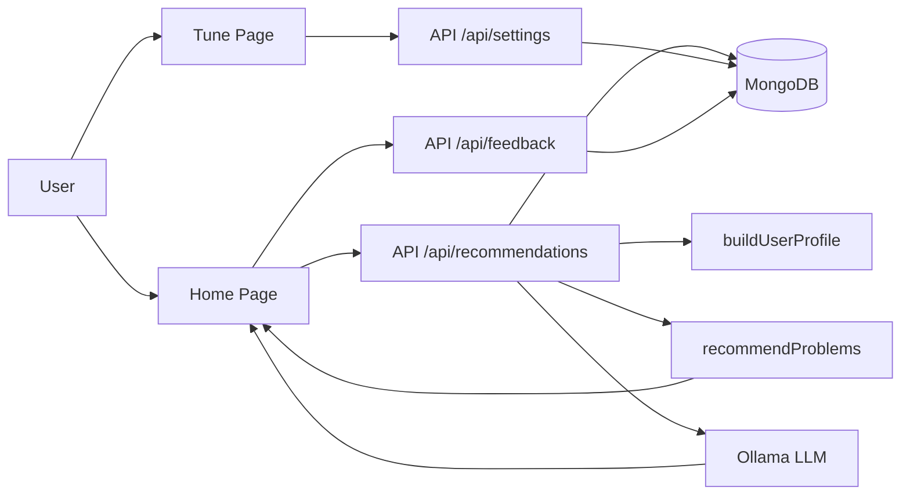

# LCGenie

LCGenie is a LeetCode study companion that syncs a user's accepted submissions, builds a skill profile, ranks unsolved problems, and explains recommendations with an LLM.

## Features

- Personalized recommendations using embeddings + LLM
- Tunable ranking system (user-controlled weights)
- Feedback-driven learning (click / solve / skip loop)
- Full LeetCode dataset (~3K problems)
- Real-time explanation generation via local LLM (Ollama)

## What it does

- Syncs accepted LeetCode submissions into MongoDB
- Seeds the problem catalog from LeetCode data
- Builds a user profile from solved problems and topic coverage
- Ranks unsolved problems using weak-topic, semantic, difficulty, and diversity signals
- Uses Ollama for LLM-based recommendation explanations
- Saves feedback events such as clicked, solved, and skipped
- Supports tuning recommendation weights from a settings page

## Architecture

A shorter version, if you want a simpler README diagram:



## Main data flow

1. `app/api/sync-leetcode/route.js` stores accepted submissions in MongoDB.
2. `app/api/seed-problems/route.js` stores the problem catalog in MongoDB.
3. `app/api/settings/route.js` saves and loads recommender weights.
4. `app/api/feedback/route.js` stores click/solve/skip feedback.
5. `app/api/recommendations/route.js` loads submissions, problems, settings, and feedback.
6. `lib/profile.js` builds a user skill profile.
7. `lib/recommender.js` scores candidate problems.
8. `lib/llm.js` generates the natural-language explanation through Ollama.
9. `app/page.js` renders the recommendation cards and feedback buttons.
10. `app/tune/page.js` lets the user adjust recommender weights.

## MongoDB collections

- `users` — synced user profile
- `submissions` — accepted LeetCode submissions
- `problems` — full problem catalog
- `settings` — global tuning configuration
- `feedback` — user interaction events

## API routes

- `POST /api/sync-leetcode`
- `POST /api/seed-problems`
- `GET /api/settings`
- `POST /api/settings`
- `GET /api/recommendations?username=<username>`
- `POST /api/feedback`

## Environment variables

```bash
MONGODB_URI=your_mongodb_connection_string
OLLAMA_URL=http://127.0.0.1:11434
OLLAMA_MODEL=llama3:latest
```

## Local setup

```bash
npm install
npm run dev
```

Then open:

- `http://localhost:3000` for recommendations
- `http://localhost:3000/tune` for settings
- `http://localhost:3000/api/recommendations?username=sanchita19Codes` for the raw JSON response

## How to verify the recommender

1. Save new settings on `/tune`.
2. Refresh `/api/recommendations?username=sanchita19Codes`.
3. Compare the returned `settings`, `recommendations`, and `scores`.
4. Click `Clicked`, `Solved`, and `Skipped` buttons on the home page.
5. Refresh again and check whether feedback changes the ranking.

## Troubleshooting

### No recommendations show on the home page

Check that `app/page.js` sends the username to the API.

### LLM explanation fails

Check `lib/llm.js` and confirm the model exists in Ollama.

### Problems are empty

Run the seed route again:

```bash
curl -X POST http://localhost:3000/api/seed-problems
```

### Feedback is not changing ranking

Confirm that:

- `app/api/recommendations/route.js` loads `feedback`
- `lib/recommender.js` accepts the `feedback` argument
- `lib/recommender.js` applies the feedback boost

## Project 

Current version includes:

- user sync
- problem seeding
- tunable ranking
- feedback loop
- LLM explanation
- UI cards for recommendations
